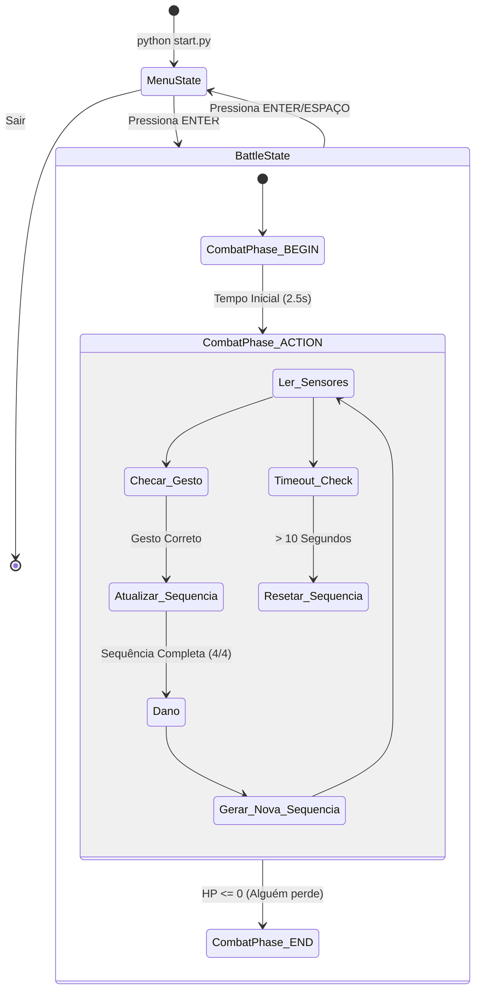

# Arquitetura Proposta

A arquitetura do sistema é baseada em três camadas operacionais distintas: Processamento de Visão, Transporte de Dados e Lógica/Hardware.

## Diagrama da Arquitetura Física e de Rede

```mermaid
graph TD
    subgraph Laptop ["Laptop (Processamento de Visão)"]
        direction TB
        C1[Câmera Jogador 1] -->|Frames| MP1[OpenCV + MediaPipe]
        C2[Câmera Jogador 2] -->|Frames| MP2[OpenCV + MediaPipe]
        
        MP1 -->|Filtra posições (ex: 1,0,1,0,0)| ARR1[Array P1]
        MP2 -->|Filtra posições (ex: 0,1,1,0,0)| ARR2[Array P2]
        
        ARR1 --> UDP_TX1[Socket UDP TX - P1]
        ARR2 --> UDP_TX2[Socket UDP TX - P2]
    end

    subgraph Rede ["Rede Wi-Fi Local"]
        UDP_TX1 -->|UDP na porta 5005| UDP_RX1[Socket RX 5005]
        UDP_TX2 -->|UDP na porta 5006| UDP_RX2[Socket RX 5006]
    end

    subgraph Raspberry ["Motor do Jogo (Pygame)"]
        direction TB
        UDP_RX1 --> PYG[Loop Principal via Select]
        UDP_RX2 --> PYG
        
        subgraph Logica ["Lógica Interna do Jogo"]
            PYG <--> FSM[Gerenciador de Estados]
            FSM --> BATTLE[BattleState: Checa Colisão do Gesto]
        end
        
        PYG -->|Atualização Visual| MON[Interface Gráfica / Monitor]
    end
```

## Diagrama de Estados do Jogo (FSM)

